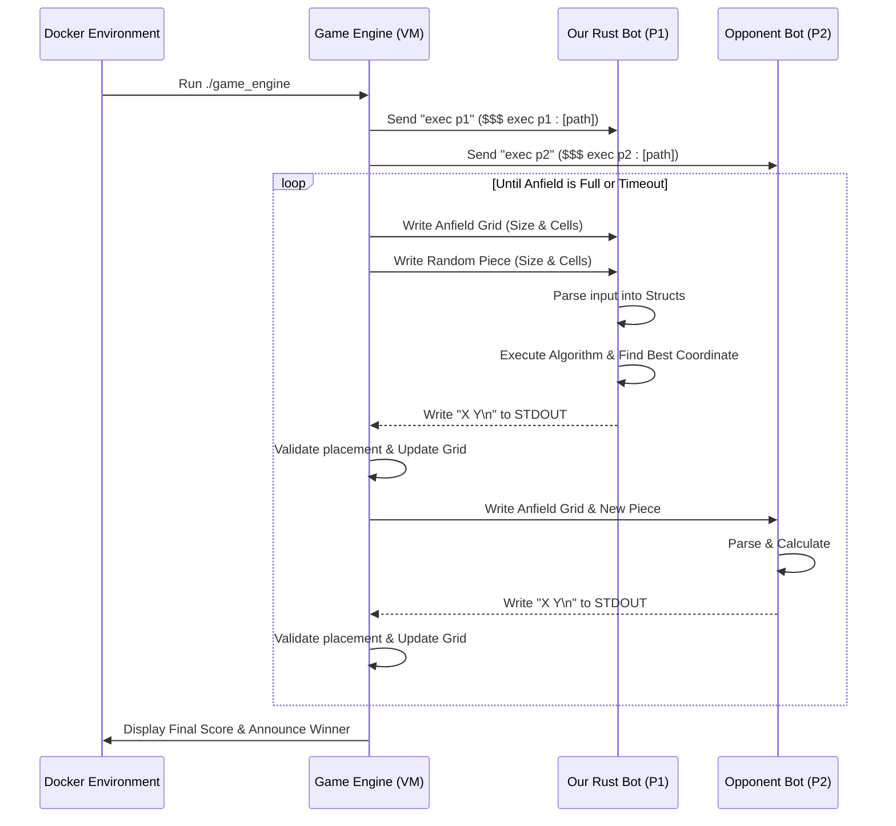
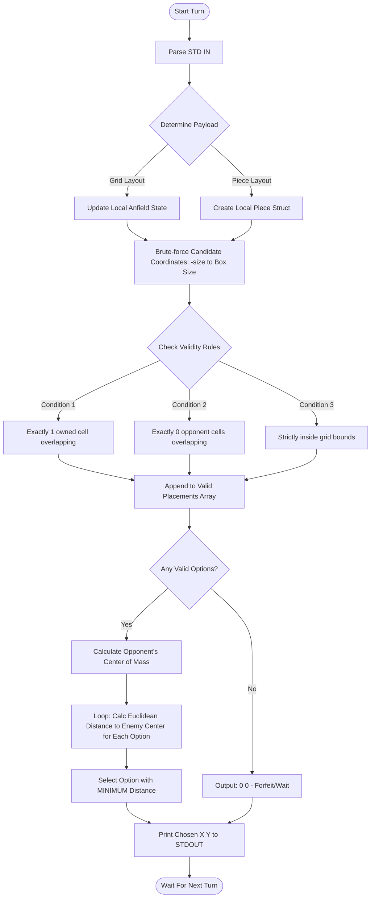

# 🤖 Filler

<p align="center">
  
</p>

<p align="center">
  <a href="#-tech-stack">Tech Stack</a> •
  <a href="#-what-makes-filler-special">Highlights</a> •
  <a href="#-architecture--data-flow">Architecture</a> •
  <a href="#-algorithm--game-logic">Algorithm</a> •
  <a href="#-getting-started">Get Started</a>
</p>

<p align="center">
  
</p>

<p align="center">
  
</p>

<p align="center">
  
  
  
  
</p>

<p align="center">
  
  
</p>

---

Filler is an algorithmic game where two bots compete against each other to dominate a predefined grid, known as the **Anfield**. The objective is straightforward but challenging: cover as much area as possible. The game engine drops randomly sized and shaped pieces turn-by-turn. The player who successfully places more of their pieces and restricts the opponent's movements wins the game.

<p align="center">
  
</p>

## ⭐ Key Highlights

- **Competitive AI Core:** Engineered with a highly competitive greedy distance-based algorithm.
- **Strict Validity Enforcement:** Mathematical boundary and territory overlay validation (Rule of One, Rule of Zero).
- **Center of Mass Calculation:** Dynamically calculates point of convergence to snuff out enemy territory dynamically.
- **Robust Parsing:** Continuous STDIN buffer consumption specifically designed for dynamic grid and piece dimension structures.
- **Battle-Ready Environment:** Fully Dockerized VM environment seamlessly resolving architecture mismatch constraints.

<p align="center">
  
</p>

## 📋 Table of Contents

- [✨ What Makes Filler Special](#-what-makes-filler-special)
- [🛠️ Tech Stack](#-tech-stack)
- [🏗️ Architecture & Data Flow](#-architecture--data-flow)
- [🧠 Algorithm & Game Logic](#-algorithm--game-logic)
- [🚀 Getting Started](#-getting-started)
- [💻 Technical Documentation](#-technical-documentation)
- [🐳 Docker Setup & Automation](#-docker-setup--automation)

<details open>
<summary><strong>✨ What Makes Filler Special (expand/collapse)</strong></summary>

## ✨ What Makes Filler Special

### 🎯 The "Move Toward Opponent" Strategy
Instead of blindly picking the first valid placement, Filler implements an aggressive "greedy" strategy. The bot re-calculates the "Center of Mass" of the opponent's total territory during every turn, acting as a heat-seeking system. 

### 🧮 Euclidean Distance Predictor
Our bot runs simulations for every possible placement over the coordinate plane. It utilizes Euclidean distance formulas `sqrt(dx^2 + dy^2)` to guarantee that every piece placed directly intersects with the opponent's growth trajectories, cutting off their "playable oxygen" efficiently.

### 🛡️ Iron-clad Overlap Regulations
The placement engine leverages brute-force arrays expanding natively to negative axis bounds (`-(piece_size - 1)`). It successfully enforces:
- **Condition 1**: Exactly 1 solid overlay onto allied territory.
- **Condition 2**: Exactly 0 intersections over enemy boundaries.
- **Condition 3**: 0 solid parts protruding out of bounds.

</details>

---
## 🛠️ Tech Stack

What powers the Filler Bot locally and in execution simulations.

### The Bot Engine
- **Rust (Standard Library)** - Highly performant, statically typed execution required for timed environments.

### DevOps - Getting It Running reliably
- **Docker** - Same environment everywhere, regardless of OS variations.
- **Linux Game Engine VM** - Orchestrates the battlefield rules and streams stdout reliably.

---
## 🏗️ Architecture & Data Flow

The game execution is orchestrated by a `game_engine` executable. Our bot operates as an independent binary communicating over `STDIN` and `STDOUT`. 

### The Interaction Protocol
- **Init:** The engine starts the game assigning the bot a token (e.g., `p1` or `p2`). Our bot parses this token to understand whether we are representing `@` / `a` or `$` / `s`.
- **Game Loop:** Each turn, the engine sends the Anfield grid and the new random piece. Our bot must calculate coordinates, output `X Y\n` within standard bounds, and the turn concludes. 

### Overall Game Flow Engine Diagram



---
## 🧠 Algorithm & Game Logic

Our bot's internal logic is cleanly layered into three steps: **Input Parsing**, **Placement Validation**, and **Strategic Selection**.

### Game Logic Sequence



---
## 💻 Technical Documentation

### Directory Structure
```text
solution/src/
├── main.rs      # Application entry-point and STDIN loop
├── parser.rs    # Converts strings from STDIN into memory structs
├── placement.rs # Mathematical overlay enforcement
├── strategy.rs  # Greedy Algorithm, Center of Mass calculation
└── types.rs     # Data structures definition (Player, Grid)
```

---
## 🚀 Getting Started & Usage Guide

We provide four distinct ways to interact with, compile, and run the Filler bot depending on your environment preference.

### 1. The Automation Script (Recommended)
This project includes a convenient automation bash script `run.sh` that wraps all the Docker and Cargo routines. It parses scores gracefully and makes verifying audits extremely simple. **(Run this outside the Docker container!)**

- **Launch Background Container**: `./run.sh docker`
- **Run the Complete Audit Suite**: `./run.sh audit` *(Runs 5 alternating matches against all standard and bonus test bots in Docker)*
  *(Note: If you have an Apple Silicon Mac, you can run `./run.sh audit m1` to bypass Docker and run the native `m1_game_engine` and `m1_robots` directly on your host system).*
- **Run Unit Tests**: `./run.sh test`
- **Compile the Custom Bot**: `./run.sh build`
- **Open Interactive Shell**: `./run.sh shell`

---

### 2. Docker Compose (Background Service)
If you prefer standard Docker Compose commands, we provide a `docker-compose.yml` natively configured for multi-arch support (including Apple M1/M2 Rosetta emulation) to prevent broken pipes.

- **Start the environment**: `docker compose up -d`
- **Stop the environment**: `docker compose down`
- **Enter the container shell**: `docker exec -it filler-bot bash`

---

### 3. Cargo Commands (Inside the Container)
Once inside the Docker container shell, you can use standard Cargo commands to compile or test the Rust binary bindings manually.

```bash
cd solution
# Build the bot in release mode natively
cargo build --release

# Run the integration and unit tests
cargo test

# Check for compiler and style warnings
cargo check
```

---

### 4. Normal Terminal Running (The Game Engine)
To run a manual game match using the official engine natively inside the shell, execute the engine with your compiled bot and a test opponent.

```bash
./linux_game_engine -f maps/map01 -p1 solution/target/release/filler -p2 linux_robots/bender
```

#### Useful Engine Flags:
| Flag | Description |
| ---- | ----------- |
| `-f` | Path to the specific map (e.g., `maps/map01`). |
| `-p1` | Path to Player 1's executable. |
| `-p2` | Path to Player 2's executable. |
| `-q` | Quiet mode (reduces console spam so you only see the final scores). |
| `-s` | Specifies a seed int for deterministic maps and pieces. |

---

## 🐳 Filler docker image

- To build the image `docker build -t filler .`
- To run the container `docker run -v "$(pwd)/solution":/filler/solution -it filler`. This instruction will open a terminal in the container, the directory `solution` will be mounted in the container as well.
- Example of a command in the container `./linux_game_engine -f maps/map01 -p1 linux_robots/bender -p2 linux_robots/terminator`
- Your solution should be inside the `solution` directory so it will be mounted and compiled inside the container and it will be able to be run in the game engine.

## 📝 Notes

- `Terminator` is a very strong robot.
- For M1 Macs use `m1_robots` and `m1_game_engine`.

---
## 👥 Authors

- **Sayed Ahmed Husain**