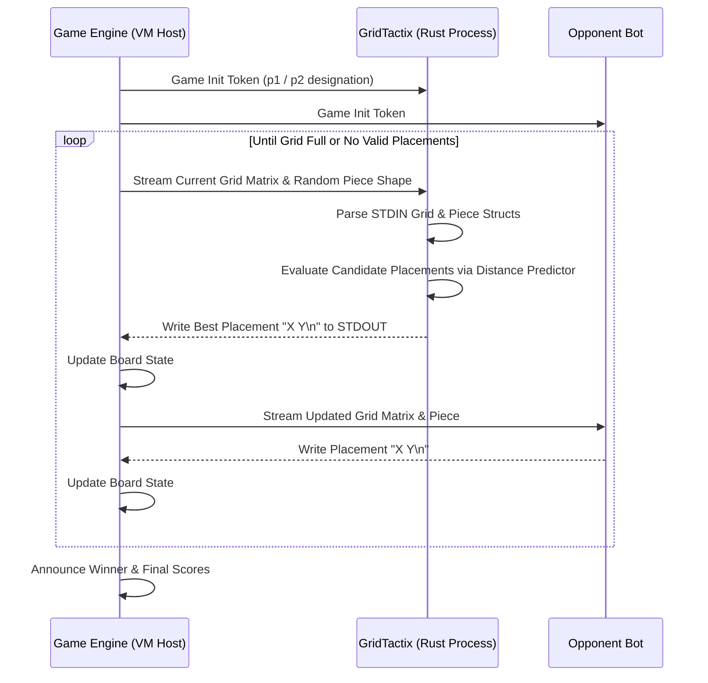
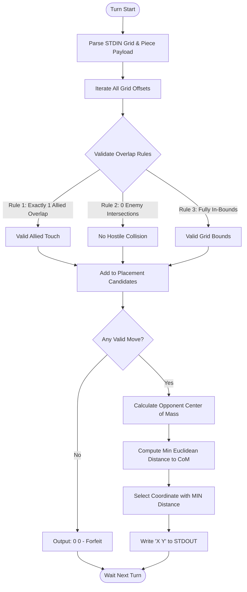

# 🤖 GridTactix

[](https://www.rust-lang.org/)
[](https://www.docker.com/)
[](LICENSE.md)

**GridTactix** is an algorithmic game bot engineered in Rust for spatial grid territory control. Operating in a competitive, turn-based grid environment, GridTactix uses a dynamic Center-of-Mass trajectory tracker and Euclidean distance predictor to place piece shapes, optimize spatial expansion, and systematically choke opponent movement paths.

---

## ⚡ Key Highlights

- **Greedy Trajectory Strategy**: Calculates opponent center of mass during every turn to dynamically head off enemy expansion vectors.
- **Euclidean Distance Predictor**: Evaluates all candidate placement coordinates using Euclidean formulas `sqrt(dx^2 + dy^2)` to select minimal-distance moves.
- **Mathematical Overlap Rules**: Enforces strict grid boundary conditions (exactly 1 allied overlap, 0 enemy intersections, 0 out-of-bound protrusions).
- **Asynchronous STDIN/STDOUT Protocol**: Streams grid board matrices and dynamic polyomino pieces line-by-line with sub-millisecond execution.
- **Containerized Battle Testing**: Fully Dockerized environment to run headless bot matches across x86 and ARM64 architectures.

---

## 📋 Table of Contents

- [Key Highlights](#-key-highlights)
- [System Architecture & Interaction Protocol](#-system-architecture--interaction-protocol)
- [Algorithmic Decision Tree](#-algorithmic-decision-tree)
- [Setup & Execution](#-setup--execution)
- [Directory Structure](#-directory-structure)
- [License](#-license)

---

## 🏗️ System Architecture & Interaction Protocol



---

## 📐 Algorithmic Decision Tree



---

## 🖥️ Live Terminal Simulation Preview

Below is an illustration of GridTactix (`@` Player 1) executing a strategic maneuver against an opponent (`$`) on a 15x17 grid, aggressively blocking territorial expansion:

```text
====================================================================
               GRIDTACTIX BATTLE ENGINE - TURN 042                  
====================================================================

      00000000001111111
      01234567890123456
 000  . . . . . . . . . . . . . . . . .
 001  . . . . . . . . . . . . . . . . .
 002  . . . . @ @ @ . . . . . . . . . .
 003  . . . @ @ @ @ @ . . . . . . . . .
 004  . . . . @ @ @ @ @ . . . . . . . .
 005  . . . . . @ @ @ @ @ @ . . . . . .
 006  . . . . . . @ @ @ @ @ @ . . . . .
 007  . . . . . . . @ @ @ [@] $ $ $ . .   <-- Target CoM Choke Point
 008  . . . . . . . . . . $ $ $ $ $ . .
 009  . . . . . . . . . . $ $ $ $ $ . .
 010  . . . . . . . . . . . $ $ $ . . .
 011  . . . . . . . . . . . . $ . . . .

Piece 3x2:
* * .
. * *

[GridTactix Strategy Engine]
 -> Opponent CoM: (8.42, 12.15)
 -> Evaluating 24 candidate placements...
 -> Optimal coordinate selected: (7, 10) [Euclidean Dist: 1.84]
 => Output stream: 7 10


---

## 🚀 Setup & Execution

### Prerequisites

- **Rust**: Rust toolchain (1.70+) installed.
- **Docker**: Optional for containerized battle suite.

---

### Local Compilation & Testing

1. **Clone Repository**:
   ```bash
   git clone https://github.com/sahmedhusain/gridtactix.git
   cd gridtactix/solution
   ```

2. **Compile Release Binary**:
   ```bash
   cargo build --release
   ```

3. **Run Unit Tests**:
   ```bash
   cargo test
   ```

---

### Running via Automation Script

Use `./run.sh` to compile, audit, and simulate matches against benchmark opponents:

```bash
# Launch background Docker environment
./run.sh docker

# Run automated audit suite against all test bots
./run.sh audit

# Run native game engine directly (macOS Apple Silicon)
./run.sh audit m1
```

---

## 📂 Directory Structure

```
gridtactix/
├── Dockerfile           # Container build file
├── docker-compose.yml   # Multi-arch Docker service manifest
├── run.sh               # Execution & audit automation script
├── maps/                # Standard game maps (map01, map02)
└── solution/
    ├── Cargo.toml       # Package metadata
    └── src/
        ├── main.rs      # Application bootstrapper and STDIN loop
        ├── parser.rs    # Text stream lexer and grid parser
        ├── placement.rs # Overlay enforcement rules
        ├── strategy.rs  # Greedy Center of Mass algorithm
        └── types.rs     # Core grid & player data models
```

---

## 📄 License

Distributed under the MIT License. See [LICENSE](LICENSE.md) for details.